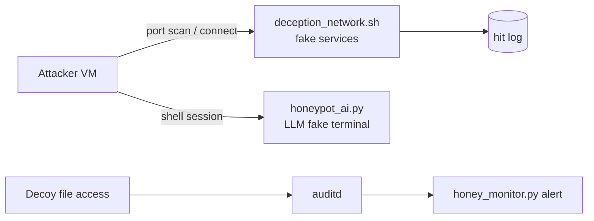

# AI Deception Honeypot

Prototype deception tools built in an isolated VirtualBox lab: fake network services, a honey-file alert, and an LLM-driven fake terminal.

## Components

| File | What it does |
|------|--------------|
| `deception_network.sh` | Opens listeners on ports 3306, 5432, 6379, 27017, and 8080 with fake MySQL, PostgreSQL, Redis, MongoDB, and web server banners. Logs each connection with a timestamp and tags it MITRE ATT&CK T1046. |
| `honey_monitor.py` | Checks the Linux audit log every 2 seconds for access to decoy files tagged `honey_file`, then prints an alert and broadcasts a warning to logged-in terminals. |
| `honeypot_ai.py` | A local LLM (Llama 3.2 1B via Ollama) plays a vulnerable Ubuntu server, returning invented output for whatever commands are typed. Decoy files include `patient_records_v2.db`. |

## Architecture



## Requirements

Ubuntu, Python 3, netcat, psmisc (`fuser`), auditd, and [Ollama](https://ollama.com) with the `llama3.2:1b` model.

## Usage

```bash
# 1. Start the fake services
sudo ./deception_network.sh

# 2. Tag a decoy file for auditd, then start the monitor
sudo auditctl -w /path/to/decoy.txt -p r -k honey_file
python3 honey_monitor.py

# 3. Run the AI fake terminal
python3 honeypot_ai.py
```

## Results

Tested by launching the deception network and probing the fake MySQL port from the same VM:

```
[DEPLOYED] Fake MySQL on port 3306
[DEPLOYED] Fake PostgreSQL on port 5432
[DEPLOYED] Fake Redis on port 6379
[DEPLOYED] Fake MongoDB on port 27017
[DEPLOYED] Fake WebServer on port 8080

[HONEYPOT HIT: MySQL on port 3306]
[ALERT] Attacker connected to fake MySQL!
        MITRE:  T1046 - Network Service Discovery
```

All five services started, and a connection to port 3306 produced a timestamped alert. Next step: repeat the test from a separate attacker VM using `nmap` to simulate a real scan.

## Limitations and next steps

- The AI shell reads from the keyboard only. Exposing it to a network would need an SSH front end (for example, `asyncssh`).
- Commands and responses aren't logged yet.
- Each command is sent to the model alone, so the fake filesystem can contradict itself. Adding session memory would fix this.
- `honey_monitor.py` re-alerts on the same access for up to 10 minutes and hides errors with a bare `except`.
- `deception_network.sh` uses `fuser -k`, which kills any process on those ports.

## Safety

Built for an isolated lab network. Don't run `deception_network.sh` on a machine with real services on those ports.
